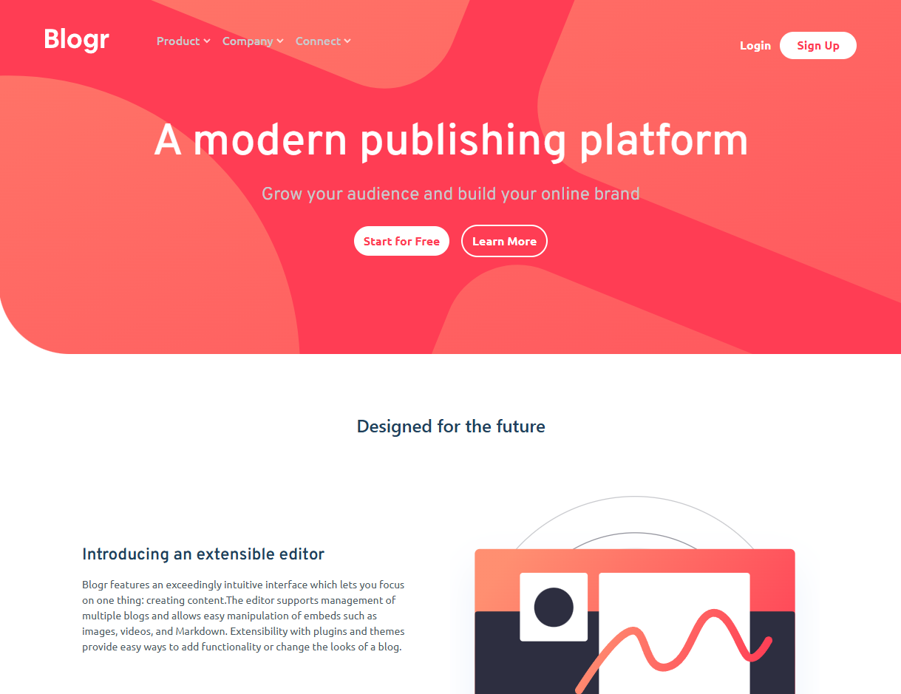

# Frontend Mentor - Blogr landing page solution

This is a solution to the [Blogr landing page challenge on Frontend Mentor](https://www.frontendmentor.io/challenges/blogr-landing-page-EX2RLAApP). Frontend Mentor challenges help you improve your coding skills by building realistic projects.

## Table of contents

- [Frontend Mentor - Blogr landing page solution](#frontend-mentor---blogr-landing-page-solution)
  - [Table of contents](#table-of-contents)
    - [The challenge](#the-challenge)
    - [Screenshot](#screenshot)
    - [Links](#links)
    - [Built with](#built-with)
    - [What I learned](#what-i-learned)
  - [Author](#author)

### The challenge

Users should be able to:

- View the optimal layout for the site depending on their device's screen size
- See hover states for all interactive elements on the page
- Interactive mobile menu

### Screenshot

This is a desktop version.

And this is a mobile version.

### Links

- Solution URL: [Add solution URL here](https://your-solution-url.com)
- Live Site URL: [Add live site URL here]([https://your-live-site-url.com](https://mthsimao.github.io/blog-landing-page/))

### Built with

- Semantic HTML5 markup
- CSS custom properties
- Flexbox
- Mobile-first workflow
- [Tailwindcss](https://tailwindcss.com/) - For styles

### What I learned

I learned more about Tailwindcss and Javascript; In tailwind I had a recap of mobile first and responsive design. And in Javascript, I had a great recap of how to better interact with DOM elements.

## Author

- Website - [Matheus Simão](https://matsimao.vercel.app)
- Frontend Mentor - [@mthsimao](https://www.frontendmentor.io/profile/mthsimao)
- Twitter - [@mthsimao](https://www.twitter.com/mthsimao1)
